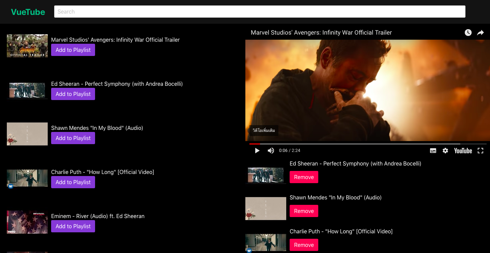

# VueTube
> Vue js project for workshop at course vue js Thailand@Sellsuki.



## API
* [how to get api key](https://developers.google.com/youtube/v3/getting-started)
* [how to search](https://developers.google.com/youtube/v3/docs/search/list)

## SET API KEY
* Set `API_KEY` in file `src/config/config.js`

```js
const config = {
  API_KEY: 'YOUR_API_KEY'
}

export default config
```

## Dependencies

* [vuex](https://github.com/vuejs/vuex)
* [vue-youtube-embed](https://github.com/kaorun343/vue-youtube-embed)

## Build Setup

``` bash
# install dependencies
npm install

# serve with hot reload at localhost:8080
npm run dev

# build for production with minification
npm run build

# build for production and view the bundle analyzer report
npm run build --report
```

For a detailed explanation on how things work, check out the [guide](http://vuejs-templates.github.io/webpack/) and [docs for vue-loader](http://vuejs.github.io/vue-loader).
